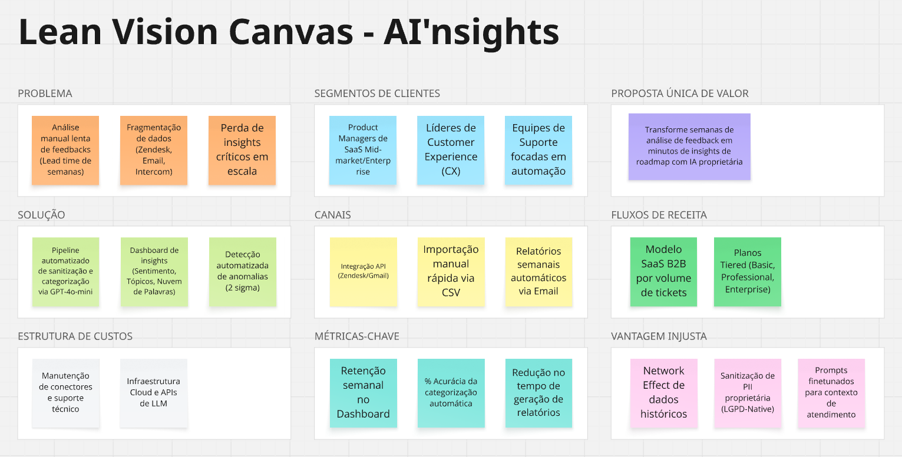
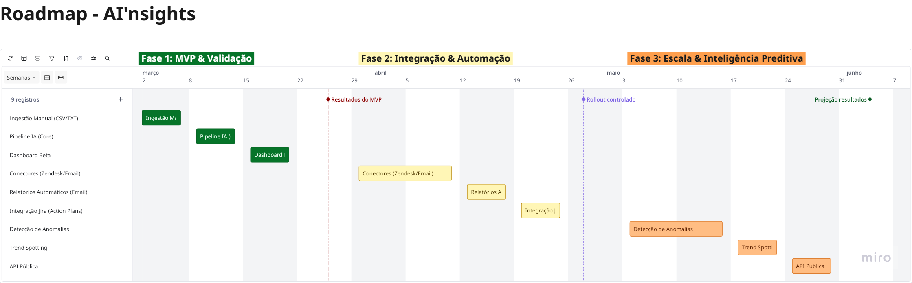
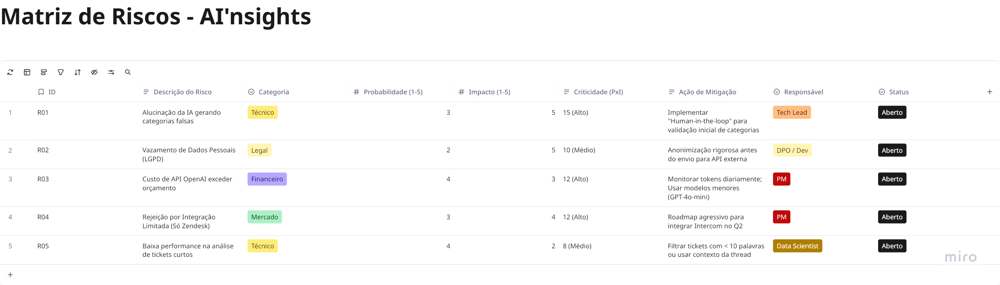

# **Graduação IA e Automação Digital - 1º Semestre**
## *Trabalho para a disciplina de Fundamentos de Gestão de Projetos*

### Projeto: AI'nsights - Do Problema ao Produto
**Objetivo:** Desenvolver uma proposta completa de produto digital com IA para análise de insights de atendimento ao cliente.

O **AI'nsights** é uma plataforma inteligente projetada para ajudar Gerentes de Customer Success (CS) a extrair valor estratégico de volumes massivos de interações (tickets, chats, e-mails), reduzindo o tempo de análise em até 80% e permitindo uma priorização baseada em dados reais e não em suposições.

# Vídeo de demonstração (Pitch):

## 🛠️ Tecnologias e Ferramentas

O projeto seguiu as melhores práticas de Gestão de Projetos e Produtos, utilizando ferramentas modernas para garantir visibilidade e controle:

| Categoria               | Recurso Principal                                |
| :---------------------- | :----------------------------------------------- |
| **Documentação**        | Markdown (Antigravity)                               |
| **Gestão Visual**       | Trello + Miro - Roadmap e Kanban estratégico     |
| **Modelagem**           | Miro - Canvas de Visão e Matriz de Riscos        |
| **Metodologias**        | PMBOK (Ciclo de Vida), Scrum (Incremental)       |

## 📌 Principais Links

- **Trabalho teórico** [📄 Trabalho Teórico](./assets/trabalho/Disciplina%20de%20Fundamentos%20de%20Gestão%20de%20Projetos%20-%20Trabalho%20Teórico.pdf)
- **Lean Canvas + Matriz de Riscos + Roadmap** [🖼️ Miro](https://miro.com/app/board/uXjVGAX0NEQ=/?share_link_id=119143343156)
- **Roadmap Visual (Trello):** [Acesse o Board do Projeto](https://trello.com/invite/b/6990eaa171fa0f1cf5a70e49/ATTIc97c3c88c31e016e3572fc185bf069b43F140572/ainsights)
- **Vídeo de demonstração (Pitch):** [Acesse o Vídeo](https://youtu.be/-DsExJu9A5U)

## 🚀 Estrutura do Trabalho

### 1. Parte Teórica

A documentação detalha a estratégia por trás do produto:
- **[Visão de Produto](./src/trabalho-final/teorico/1-visao-produto.md):** Definição do problema e proposta de valor.
- **[Definição do MVP](./src/trabalho-final/teorico/2-mvp-definicao.md):** Funcionalidades essenciais e critérios de priorização.
- **[Roadmap do Produto](./src/trabalho-final/teorico/3-roadmap-descritivo.md):** Planejamento em 3 fases (MVP, Integrações, Predição).
- **[Ciclo de Vida](./src/trabalho-final/teorico/4-ciclo-de-vida.md):** Fases de descoberta até a evolução.
- **[Gestão de Riscos](./src/trabalho-final/teorico/5-gestao-riscos.md):** Mitigação de problemas técnicos e de mercado.
- **[IA e Ética](./src/trabalho-final/teorico/6-gestao-ia.md):** Considerações específicas sobre alucinações e privacidade.

### 2. Parte Prática
Artefatos visuais gerados para simular a rotina de um Product Manager:

#### Canvas de Visão (Lean Vision Canvas)
O ponto de partida para a estratégia do AI'nsights.

#### Roadmap Estratégico
Visão temporal das entregas divididas em fases de maturidade do produto.

#### Matriz de Riscos
Análise de probabilidade e impacto para os principais desafios do projeto.

---
*Este material foi produzido como entrega final para a graduação em Inteligência Artificial e Automação Digital.*